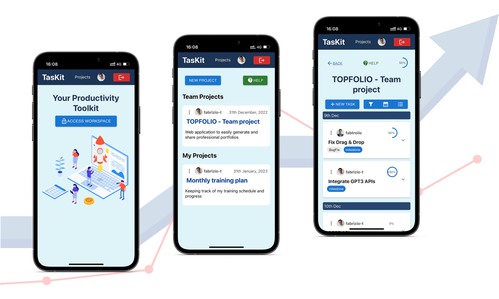

# TasKit

Toolkit to manage personal and team tasks

<p align="center">
  
</p>


Trash Walk is a mobile (iOS) app aimed at helping us make the world a cleaner place! The app is a tool for people cleaning (doing "trash walks"), and uses their phones GPS to save their walks to a shared database. This brings two main benefits:

1. It documents the efforts made, for the ones volunteering their time (and everyone else!).
2. Make the activitity more gratifying to the trash walkers themselves by "gamification" and social functions.

## Screenshots

<p align="center">
  
</p>


## Getting started

Except for the regular suspects; git, Node, npm, you need these things to work on the Trash Walk app. Follow the instructions supplied below them or on their links to get them up and running before you continue with *Installation*.

* Xcode (latest version, at least >9.3). Install from App Store.
* [Cocoapods](https://cocoapods.org) - a dependency manager for Swift and Objective-C Cocoa projects. 
  ```sudo gem install cocoapods```
* [Expo XDE](https://www.expo.io) - the Expo development environment.
  ```npm install -g exp```

**Recommended!**

* The [Trash Walk backend](https://github.com/cherlin/trash-walk-backend) is highly recommended as well, if you want any sort of useful interaction with the app.
* [React Native Debugger](https://github.com/jhen0409/react-native-debugger) - a debugger built on the Chrome debugger, including React and Redux Dev Tools.

## Installation

### Prerequisites
Before installing the project, you need to have the following software installed on your machine:
- Node.js
- MongoDB

### Setup
1. Clone the repository
```
git clone https://github.com/your-username/TasKit.git
```
2. Navigate to the project's root directory
```
cd TasKit
```
3. Create a .env file in the root directory of the project
```
touch .env
```
4. Add the following environment variables to the `.env` file
```
PORT=
CLIENT_ORIGIN_URL=
AUTH0_AUDIENCE=
AUTH0_DOMAIN=
DB_USER=
DB_PASSWORD=
DB_URL=
```
5. Create a `.env` file in the `client` directory
```
cd client
touch .env
```
6. Add the following environment variables to the `client/.env` file
```
REACT_APP_AUTH0_DOMAIN=
REACT_APP_AUTH0_CLIENT_ID=
REACT_APP_AUTH0_CALLBACK_URL=
REACT_APP_API_SERVER_URL=
REACT_APP_AUTH0_AUDIENCE=
```

7. Install project dependencies
```
npm install
```

## Tech Stack

* [React Native](https://facebook.github.io/react-native/) (ejected from Expo)
* [Redux](https://redux.js.org/)
* Other dependencies:
  * [React Native Background Geolocation](https://github.com/transistorsoft/react-native-background-geolocation)
  * [React Native Maps](https://github.com/react-community/react-native-maps)

## Developers

* Christofer Herlin - [GitHub](https://github.com/cherlin) - [LinkedIn](https://www.linkedin.com/in/cherl/)
* Juliane Nagao - [GitHub](https://github.com/junagao) - [LinkedIn](https://www.linkedin.com/in/junagao/)
* Necati Özmen - [GitHub](https://github.com/necatiozmen) - [LinkedIn](https://www.linkedin.com/in/necatiozmen/)
* Marco Antonio Ghiani - [GitHub](https://github.com/marcoantonioghiani01) - [LinkedIn](https://www.linkedin.com/in/marcoantonioghiani/)
